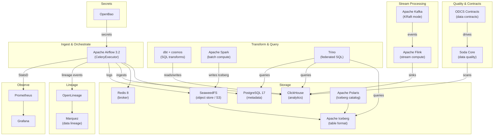
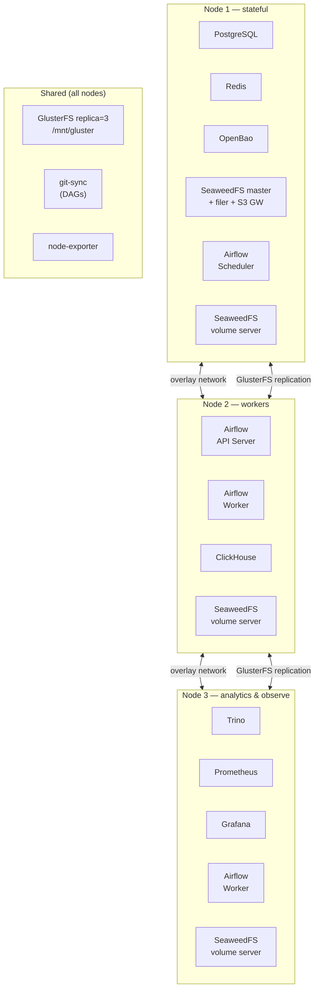

# Open-Source Data Platform

A self-hosted, 100% open-source data platform. Deploy locally with Docker Compose,
scale with Docker Swarm or self-hosted Kubernetes — no cloud accounts required.

All tools are Apache 2.0 or similarly permissive licensed. No AGPL, no proprietary
managed services.

---

## System Overview



---
## Docker Swarm Topology (Production)



---

## Stack

| Function           | Tool                                 | License    |
|--------------------|--------------------------------------|------------|
| Orchestration      | Apache Airflow 3.2                   | Apache 2.0 |
| Relational DB      | PostgreSQL 17                        | PostgreSQL |
| Broker             | Redis 8                              | BSD        |
| Analytics DB       | ClickHouse                           | Apache 2.0 |
| Object storage     | SeaweedFS                            | Apache 2.0 |
| Secrets            | OpenBao                              | MPL 2.0    |
| SQL transforms     | dbt-core + dbt-clickhouse + cosmos   | Apache 2.0 |
| Federated SQL      | Trino                                | Apache 2.0 |
| Batch compute      | Apache Spark                         | Apache 2.0 |
| Stream ingest      | Apache Kafka (KRaft)                 | Apache 2.0 |
| Stream compute     | Apache Flink                         | Apache 2.0 |
| Table format       | Apache Iceberg                       | Apache 2.0 |
| Iceberg catalog    | Apache Polaris                       | Apache 2.0 |
| Data quality       | Soda Core                            | Apache 2.0 |
| Data contracts     | ODCS 3.1.0 + custom Airflow provider | Apache 2.0 |
| Data lineage       | Marquez + OpenLineage                | Apache 2.0 |
| Metrics            | Prometheus + Grafana                 | Apache 2.0 |
| Distributed FS     | GlusterFS                            | LGPL v3    |
| Prod orchestration | Docker Swarm                         | Apache 2.0 |
| K8s orchestration  | k3s / kubeadm                        | Apache 2.0 |

---

## Local Development

**Prerequisites:** Docker, Docker Compose, Python 3.12, `uv`

```bash
cp .env .env.local          # review and adjust credentials
uv sync --dev

# Start everything
make up

# Or start individual components
make up airflow
make up clickhouse
make up openbao       # OpenBao (default secrets manager)
make up vault         # HashiCorp Vault (alternative — shares port 8200, run one or the other)
make up seaweedfs
make up trino
make up spark
make up kafka
make up flink         # starts Kafka + Flink JobManager + TaskManager
```

After starting the secrets manager and SeaweedFS, seed them:

```bash
make openbao-init     # writes secrets Airflow needs to OpenBao dev instance
make vault-init       # alternative: seed HashiCorp Vault instead
make seaweedfs-init   # creates airflow-logs, backups, iceberg-warehouse buckets
make kafka-init       # creates default Kafka topics (raw-orders, flink-output)
```

### Service URLs

| Service            | URL                   | Credentials       |
|--------------------|-----------------------|-------------------|
| Airflow UI         | http://localhost:8080 | airflow / airflow |
| Flower (Celery)    | http://localhost:5555 | —                 |
| OpenBao / Vault UI | http://localhost:8200 | token: `root`     |
| SeaweedFS filer UI | http://localhost:8888 | —                 |
| SeaweedFS S3 API   | http://localhost:8333 | see `.env`        |
| Trino UI           | http://localhost:8085 | —                 |
| Spark master UI    | http://localhost:8090 | —                 |
| ClickHouse HTTP    | http://localhost:8123 | see `.env`        |
| Kafka broker       | localhost:9092        | —                 |
| Flink Web UI       | http://localhost:8082 | —                 |

---

## Repository Layout

```text
data-platform/
├── airflow/
│   └── dags/
│       ├── plugins/
│       │   ├── docker_secrets_backend.py       # dev secrets fallback
│       │   └── providers/
│       │       ├── odcs/                       # ODCS contract validation provider
│       │       └── soda/                       # Soda Core scan provider
│       ├── marquez-demo/                   # lineage demo DAGs
│       ├── backup_dag.py                   # nightly DB backups to SeaweedFS
│       ├── dbt_clickhouse_dag.py           # dbt via astronomer-cosmos DbtDag
│       └── spark_example_dag.py            # Spark Iceberg example
├── data-contracts/                         # ODCS 3.1.0 data contract definitions
├── dbt/                                    # dbt project (ClickHouse target)
│   └── models/
│       ├── staging/                        # stg_orders (view)
│       ├── intermediate/                   # int_orders_enriched (view)
│       └── marts/                          # fct_orders (incremental ReplacingMergeTree)
├── soda/                                   # Soda data quality checks
│   └── checks/
├── infra/
│   ├── ARCHITECTURE.md                     # Deep-dive architecture reference
│   ├── dev/compose/                        # Docker Compose for local dev
│   │   ├── airflow.lite.yaml               # Airflow with LocalExecutor
│   │   ├── clickhouse.yaml
│   │   ├── seaweedfs.yaml                  # S3-compatible object store
│   │   ├── openbao.yaml                    # OpenBao (dev mode, default)
│   │   ├── hashicorp-vault.yaml            # HashiCorp Vault (dev mode, alternative)
│   │   ├── trino.yaml                      # Federated SQL engine
│   │   ├── spark.yaml                      # Spark standalone cluster
│   │   ├── kafka.yaml                      # Apache Kafka (KRaft mode)
│   │   └── flink.yaml                      # Apache Flink JobManager + TaskManager
│   ├── docker-stack/                       # Docker Swarm production deployment
│   │   ├── ansible/                        # Cloud-agnostic Ansible playbooks
│   │   ├── compose/                        # Swarm stack compose files
│   │   │   ├── airflow.yaml
│   │   │   ├── databases.yaml              # PostgreSQL + Redis
│   │   │   ├── openbao.yaml                # OpenBao (default secrets manager)
│   │   │   ├── hashicorp-vault.yaml        # HashiCorp Vault (alternative)
│   │   │   ├── storage.yaml                # SeaweedFS
│   │   │   ├── analytics.yaml              # ClickHouse + Trino
│   │   │   ├── streaming.yaml              # Kafka + Flink
│   │   │   └── monitor.yaml                # Prometheus + Grafana
│   │   ├── config/                         # Server config files (uploaded as Docker configs)
│   │   │   └── openbao.hcl
│   │   └── docs/                           # Operational runbooks
│   ├── images/
│   │   ├── airflow.Dockerfile
│   │   └── spark/Dockerfile                # Spark + Iceberg + AWS JARs
│   └── k8s-stack/                          # Self-hosted Kubernetes stack
│       ├── helmfile.yaml
│       └── helm/base/                      # Helm values for all services
├── pyproject.toml
└── Makefile
```

---

## dbt Pipeline

The dbt project targets ClickHouse and follows a 3-layer architecture:

```
raw.orders (Airflow ingestion)
  └── staging.stg_orders        (view — type casting, null filtering)
        └── intermediate.int_orders_enriched   (view — EUR conversion, derived fields)
              └── marts.fct_orders              (incremental ReplacingMergeTree)
```

Run locally:
```bash
cd dbt
dbt deps --profiles-dir .
dbt run --profiles-dir .
dbt test --profiles-dir .
```

---

## Data Contracts

Contracts live in `data-contracts/` and follow the
[Open Data Contract Standard (ODCS)](https://bitol-io.github.io/open-data-contract-standard/)
v3.1.0. Each contract embeds SodaCL quality checks executed via the custom
`airflow-provider-odcs` Airflow provider (see `providers/airflow-provider-odcs/`).

See [`data-contracts/README.md`](data-contracts/README.md) for how to add new contracts.

---

## Production Deployment

### Docker Swarm (Linux VMs)

See [`infra/ARCHITECTURE.md`](infra/ARCHITECTURE.md) for the full architecture reference
and [`infra/docker-stack/docs/`](infra/docker-stack/docs/) for operational runbooks.

```bash
# Deploy on a 3-node Swarm cluster
docker stack deploy -c infra/docker-stack/compose/databases.yaml data-platform
docker stack deploy -c infra/docker-stack/compose/openbao.yaml data-platform
# → run: bao operator init + unseal (see infra/docker-stack/docs/openbao_setup.md)
docker stack deploy -c infra/docker-stack/compose/storage.yaml data-platform
docker stack deploy -c infra/docker-stack/compose/airflow.yaml data-platform
docker stack deploy -c infra/docker-stack/compose/analytics.yaml data-platform
docker stack deploy -c infra/docker-stack/compose/streaming.yaml data-platform
docker stack deploy -c infra/docker-stack/compose/monitor.yaml data-platform
```

### Kubernetes (k3s / kubeadm)

See [`infra/k8s-stack/README.md`](infra/k8s-stack/README.md).

```bash
cd infra/k8s-stack
helmfile sync
```

---

## Development

```bash
uv sync --dev
uv run pytest
uv run ruff check .
uv run ruff format .
```

---

## License

GNU General Public License v3. See [`LICENSE`](LICENSE).
